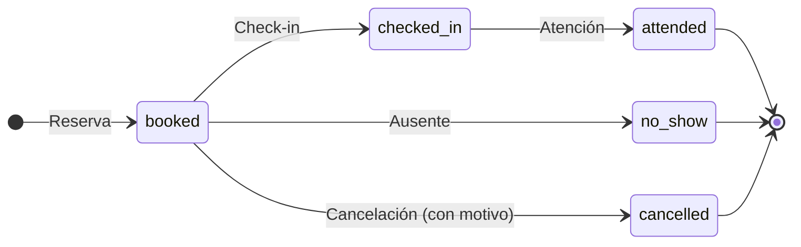
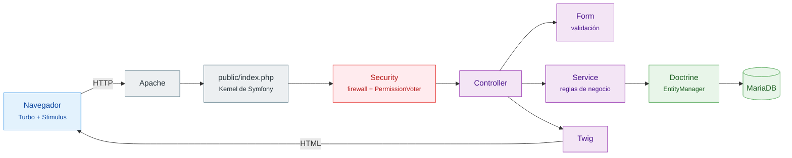
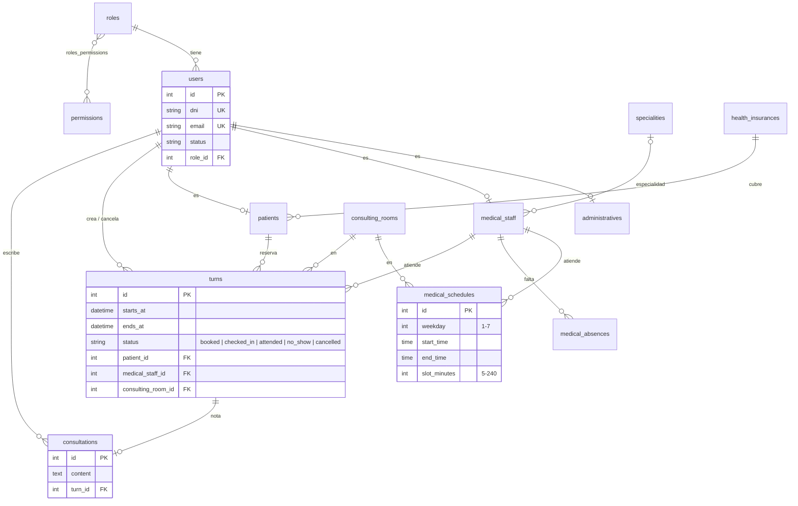

<div align="center">


<h1>Vitalis</h1>

**Sistema de gestión para centros clínicos**

Turnos · Agenda médica · Pacientes · Obras sociales · Notas de consulta · Roles y permisos

<br/>


<br/>

[Funcionalidades](#funcionalidades) •
[Inicio rápido](#inicio-rápido) •
[Arquitectura](#arquitectura) •
[Modelo de datos](#modelo-de-datos) •
[Estructura](#estructura)

</div>

<br/>

> [!NOTE]
> **Origen del proyecto.** Esta es la reescritura en Symfony de
> [Centro-clinico-Vitalis](https://github.com/Carril-fol/Centro-clinico-Vitalis),
> un proyecto universitario grupal de 2024 hecho en PHP sin framework junto a
> [ZekkiMe](https://github.com/ZekkiMe).

---

## Funcionalidades

<table>
  <tr>
    <td width="50%" valign="top">
      <h3>Turnos</h3>
      Reserva con validación de agenda, ausencias y solapamientos. Check-in, atención, ausente y cancelación con motivo.
    </td>
    <td width="50%" valign="top">
      <h3>Agenda médica</h3>
      Horarios semanales por consultorio y ausencias por rango de fechas.
    </td>
  </tr>
  <tr>
    <td width="50%" valign="top">
      <h3>Notas de consulta</h3>
      Los médicos que atienden registran una nota que queda en la historia del paciente.
    </td>
    <td width="50%" valign="top">
      <h3>Roles y permisos</h3>
      Acceso basado en roles (RBAC): los administradores delegan permisos a cada rol para restringir su uso dentro de la aplicación.
    </td>
  </tr>
  <tr>
    <td width="50%" valign="top">
      <h3>Catálogos</h3>
      Especialidades, obras sociales y consultorios.
    </td>
    <td width="50%" valign="top">
      <h3>Landing pública</h3>
      Página pública del centro, con acceso separado para el personal.
    </td>
  </tr>
</table>

### Ciclo de vida de un turno



---

## Qué cambió respecto del original

| Aspecto                  | Original (2024)    | Esta versión                              |
|--------------------------|--------------------|-------------------------------------------|
| Framework                | PHP sin framework  | **Symfony 7.4**                           |
| Acceso a datos           | SQL a mano         | **Doctrine ORM**                          |
| Esquema de la base       | Script SQL         | **Doctrine Migrations** versionadas       |
| Permisos                 | —                  | **Voter de Symfony** con permisos por rol |
| Seguridad de formularios | —                  | **CSRF** en todos los formularios         |
| Puesta en marcha         | Manual             | **`docker compose up`**                   |

---

## Inicio rápido

### Con Docker (recomendado)

**1. Crear `.env.docker`** en la raíz del proyecto:

```env
APP_SECRET=
DB_ROOT_PASSWORD=
```

| Variable           | Requerida | Descripción                            |
|--------------------|:---------:|----------------------------------------|
| `APP_SECRET`       | Sí        | Secreto de Symfony                     |
| `DB_ROOT_PASSWORD` | Sí        | Contraseña de root de MariaDB          |
| `APP_PORT`         | No        | Puerto del host (por defecto `8000`)   |

**2. Levantar los contenedores:**

```bash
docker compose --env-file .env.docker up --build -d
```

> [!TIP]
> Al arrancar, el contenedor corre las migrations automáticamente: crea las tablas,
> los roles, los permisos, los catálogos base y el usuario administrador.

**3. Cargar datos de prueba** — médicos, pacientes, horarios y turnos:

```bash
docker compose --env-file .env.docker exec -T db mariadb -uroot -p<DB_ROOT_PASSWORD> php_mvc < seed.sql
```

En PowerShell:

```powershell
Get-Content seed.sql -Raw | docker compose --env-file .env.docker exec -T db mariadb -uroot -p<DB_ROOT_PASSWORD> php_mvc
```

**4. Abrir** [http://localhost:8000](http://localhost:8000)

<details>
<summary><b>Levantar en local (XAMPP)</b></summary>

<br/>

**Requisitos:** PHP 8.2+, Composer y MySQL/MariaDB.

```bash
composer install
```

Crear `.env.local` con la conexión a la base:

```env
DATABASE_URL="mysql://root:<password>@127.0.0.1:3306/php_mvc?serverVersion=10.4.32-MariaDB&charset=utf8mb4"
```

```bash
php bin/console doctrine:database:create
php bin/console doctrine:migrations:migrate
mysql -uroot -p php_mvc < seed.sql      # opcional
php -S localhost:8000 -t public
```

</details>

### Usuarios de prueba

Todos usan la contraseña **`admin123`**.

| Rol           | Email                          | Origen       |
|---------------|--------------------------------|--------------|
| Administrador | `admin@vitalis.test`           | migrations   |
| Médico        | `laura.benitez@vitalis.test`   | `seed.sql`   |
| Paciente      | `julieta.morales@vitalis.test` | `seed.sql`   |

> [!WARNING]
> Estas credenciales son solo para desarrollo. Cambialas antes de desplegar en cualquier entorno real.

---

## Arquitectura

Monolito **MVC organizado por módulo** (`src/Turns`, `src/Patients`, …). Cada módulo tiene `Controllers`, `Forms`, `Models` y `Services`.



| Capa            | Responsabilidad                                                                 |
|-----------------|---------------------------------------------------------------------------------|
| **Controllers** | Reciben el request, chequean permisos con `#[IsGranted]` y delegan.             |
| **Services**    | Reglas de negocio: disponibilidad de turnos, solapamiento de horarios, quién puede escribir una nota. |
| **Models**      | Entidades de Doctrine mapeadas con atributos.                                   |
| **Forms**       | Tipos de formulario de Symfony con sus validaciones.                            |

---

## Modelo de datos



### Migraciones

La estructura se maneja con **Doctrine Migrations** (`migrations/`). Después de cambiar una entidad:

```bash
php bin/console make:migration
php bin/console doctrine:migrations:migrate
```

> [!IMPORTANT]
> Los `CHECK` constraints están en una migration aparte, escrita a mano,
> porque Doctrine no los genera a partir de las entidades.

---

## Estructura

El código está organizado por módulo dentro de `src/`:

```text
src/
└── <Módulo>/
    ├── Controllers/
    ├── Forms/
    ├── Models/      ← entidades
    └── Services/
```

| Módulo                                                | Qué hace                                             |
|-------------------------------------------------------|------------------------------------------------------|
| `Auth`                                                | Login y chequeo de permisos (`PermissionVoter`)      |
| `Users`                                               | Usuarios base                                        |
| `Roles`, `Permissions`                                | Roles por área y sus permisos                        |
| `Administratives`                                     | Personal administrativo                              |
| `MedicalStaff`                                        | Médicos, horarios y ausencias                        |
| `Patients`                                            | Pacientes y obra social                              |
| `Specialities`, `HealthInsurances`, `ConsultingRooms` | Catálogos                                            |
| `Turns`                                               | Reserva, check-in, atención y cancelación de turnos  |
| `Consultations`                                       | Notas de consulta e historia del paciente            |
| `Dashboard`, `Landing`                                | Panel principal y página pública                     |

---

<div align="center">
<sub>Hecho con Symfony · Reescritura de un proyecto universitario de 2024</sub>
</div>